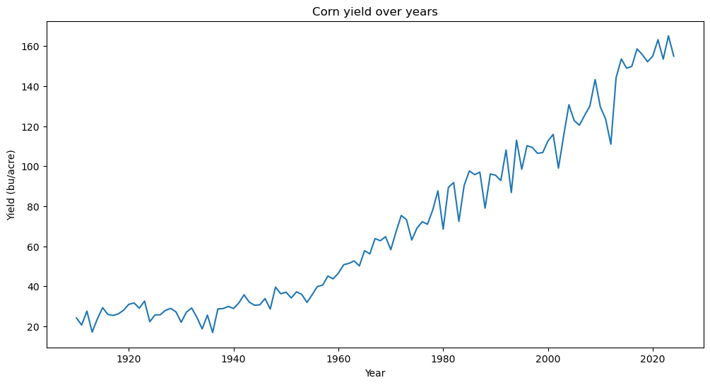
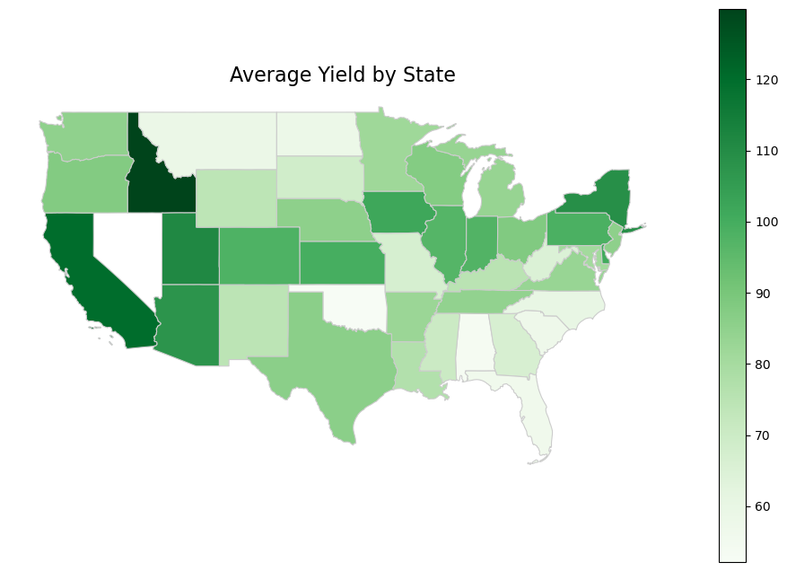
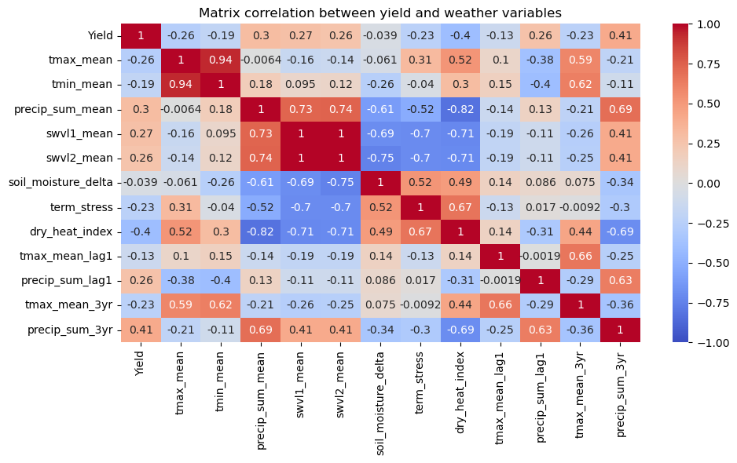
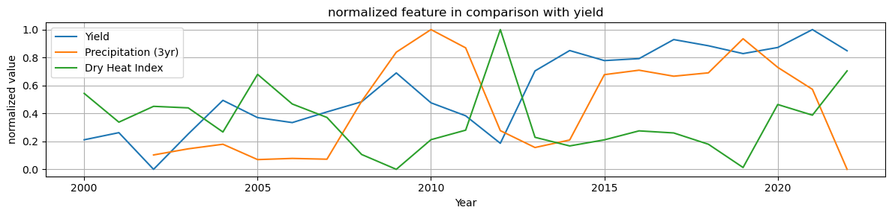
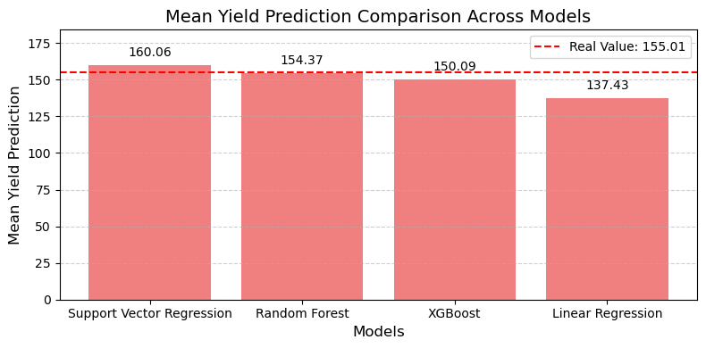

# Predicting 2024 U.S. Corn Yield  

## Objective

Build a model to **predict the 2024 U.S. national corn yield (bu/acre)** using historical USDA yield data and weather data. The final output includes:

- A **point prediction** and **uncertainty estimate** for 2024.
- An evaluation of model performance on past years.
- Clear documentation of assumptions, logic, process, and key findings.

---

## Project Outline

### 1. Data Acquisition

- Download **historical corn yield data** at county, state, and national level from USDA quick stats trough the [API](https://quickstats.nass.usda.gov/api) provided.
- Load **daily county-level weather data** already in possession with the project, *wx_hist_df.parquet*.

### 2. Data Sanity Check

- Merging data of yield in one .csv since the request allowed not more than 50.000 records togheter
- Validation of the yield data and weather data.
- Handling missing values, check for unit consistency, and verifying dimensions.
- Different granularity: The yield data from USDA quick stats is from 1910 at year level and the weather data is at daily level from 2000.  

### 3. Exploratory Data Analysis

- It is clear that yields rose sharply from 1920 to 2020, especially after 1960 due to hybrid crops, with fluctuations likely from weather or global events.
- Yield values exhibit a strong year-to-year correlation, indicating that high yields are typically followed by similarly high yields, while low yields tend to persist.

After the aggregation of the yield for every state, the first 5 states with the highest average yield were:
    
    | State Name  | Yield (bu/acre)|
    |-------------|----------------|
    | IDAHO       | 129.907670     |
    | CALIFORNIA  | 119.936595     |
    | UTAH        | 111.171765     |
    | NEW YORK    | 109.179003     |
    | ARIZONA     | 107.542978     |

 
### 4. Feature Engineering

- Derive relevant features from the raw weather data: 
It’s better to have biologically meaningful features than a lot of noisy or redundant features. For this reason the feature  engineering included the calculation of: 
    - **Biological and stress features**:  
    - `soil_moisture_delta`: Captures the difference between surface and sub-surface soil moisture
    - `term_stress`: Captures stress of plants by disrupting respiration and photosynthesis
    - `dry_heat_index`: Combines heat and dryness into a single stress indicator
    - **Rolling Features and multi-year rolling averages**: to capture temporal patterns  
    - `tmax_mean_lag1`: to capture carry-over effects of temperature
    - `precip_mean_lag1`: to capture carry-over effects of precipitations
    - `tmax_mean_3yr`: to capture longer-term trends for temperature
    - `precip_mean_3yr`: to capture longer-term trends for precipitations
  
- Feature selection:
  To build a machine learning model to predict yield, we want features that are correlated with yield but they shouldn't be too redundant with each other (to avoid multicollinearity). Highly redundant features were therefore removed to ensure each input contributes unique and meaningful information.

  The matrix correlation of the features at state level:

- Examinating the relationships between weather patterns and yield outcomes, several things shown up: 
    - A sharp decrease in yield around 2012
    - The decrease in yield coincides with a drastic drop in total rainfall
    - Reduced precipitation led to a decline in soil moisture levels 
    - During the same period of reduced precipitation the average maximum temperatures were the highest (drought)
    - When maximum temperatures hover around 25 °C and adequate rainfall and soil moisture are present, yields tend to perform best

### 5. Model Development & Evaluation

My reasoning followed these steps:

- I modeled using only the time series containing yield data since 1910, without including weather variables, to establish a reference baseline.
- I incorporated annual weather data using aggregated information.
- I built machine learning models using county-level data to increase the number of usable observations.
  
At this point, I faced a choice: to use machine learning models that treat each observation independently, or to consider that temporal order matters—because past values influence future ones. Since yield in the previous year is correlated with yield in the current year, I chose to treat the data as a time series in order to capture the dependence between past and future values of the same variable.

- ML models:
    To ensure consistency and valid feature-target relationships, I have aggregated weather data to yearly resolution, aligning it with the annual yield data at county level.  
    With this method it was possible:
    - Increase the effective sample size by modeling many counties across multiple years (instead of just one national average per year).
    - Exploit spatial variation because weather effects vary by region, and modeling at the county level let me capture these localized patterns.
  
    | **Model**                          | **Why**                                                                                                                  |
    |-----------------------------------|--------------------------------------------------------------------------------------------------------------------------|
    | **Linear Regression**             | Baseline model to understand linear relationships and feature importance. Simple interpretable.                        |
    | **Support Vector Regression (SVR)** | Good for non-linear relationships; works well with smaller datasets and can model complex feature interactions.         |
    | **Random Forest Regression**      | Non-parametric, captures non-linearities and feature interactions. Robust to overfitting and provides feature importance.|
    | **XGBoost**                       | Gradient boosting framework that handles non-linearity well, optimizes performance, and includes regularization.         |

### 6. Predict 2024 Yield

Weather data for 2024 was not fully available, especially for the latter part of the growing season (e.g. July–September), which are crucial for final yield determination.
My approach was to use the historical average for each feature across previous years as a proxy for the missing 2024 values. This was fast, stable, and unbiased estimate.

Results for the different models:

All models provided reasonable yield predictions, but their performance varied significantly due to differences in their ability to model linear and nonlinear relationships in the data. Weather and yield dynamics are complex, requiring models that can handle intricate interactions.

Support Vector Regression (SVR) delivered the strongest overall performance, with the highest R² (0.51), lowest MAE and MSE, and remarkably low standard deviation. Its ability to model nonlinear boundaries while maintaining generalization makes it well-suited to agricultural datasets.

XGBoost also performed well, with competitive error metrics and moderately stable predictions. It leverages gradient boosting and regularization to capture complex feature relationships, making it ideal for data with nonlinear patterns—although it showed slight underestimation in yield.

Random Forest provided the closest mean prediction to the actual yield (–0.68), but lower R² and high variance suggest it captures nonlinearities inconsistently. Its ensemble nature allows for flexibility, yet the variability in output reflects uneven fit quality across samples.

Linear Regression, being purely linear, struggled to capture the depth of the relationships present. Its low R² and relatively high error metrics underline its limitations in modeling interactions and nonlinear effects within the weather and yield data.

### 7. Reporting

**Key Findings:**
- A spike in the Dry Heat Index (notably in 2012) aligns with yield reduction
- Weather plays a significant role in annual yield fluctuations, especially drought years
- Positive correlation between long-term water availability (`precip_sum_3yr`) and yield
- Yield is highest when: Tmax is ~25°C and rainfall and soil moisture are above average
- High yields during 2020–2023 despite lower rainfall suggest possible irrigation use or other agronomic adaptations that buffer against moisture stress

**Limitations of the models:**
- Model bias risk: yield predictions could reflect historical production patterns more than emerging climate signals if feature importance is skewed by correlated inputs
- Weather gaps: Proxying with historical averages for 2024 introduces uncertainty
- No management factors: Models do not account for irrigation, hybrid varieties, fertilizer usage, or pest events
- Aggregation tradeoff: Yearly aggregation removes intra-seasonal dynamics

**Future Improvements:** 
- Hyperparameter tuning: Optimize models with techniques like randomized search to enhance predictive performance.
- Integrate season weather: Use real data or forecasts for July–September 2024 weather features
- Add agronomic variables: Incorporate crop type, irrigation levels, planting dates, etc
- Scenario modeling: simulate how changes in specific factors (e.g. rainfall increase, drought onset) would impact yield to inform adaptive strategies.

---
